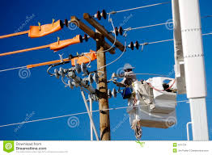

## Objectives/Rationale


The basic objective was to develop and deploy a prediction model that could form the framework for a range of applications : from water useage, to the mean time before failure (MTBF) of machine parts.

Prediction Models are applied in a wide range of fields - especially given the "explosion" of data being generated today.  Monitoring data is particularly useful here, as the number variables being electronically monitored, the accuracy, and the sampling rate lends itself to fairly accurate results - using established statistical techniques.

<div style='text-align: center;'>
    
</div>

---

## Objectives (cont'd...)

Implications for Unified Maintenance Planning in large-scale industries such as utilities are clear.  The mtbf of say conductor joints or steam boiler parts (disparate sectors of the utility) can be estimated on a central platform available to a range of professionals.  Established datasets with performance information under different conditions would be regularly sourced from teh websites of authorities such as US Department of Energy and the Electric Power Research Institute.

<div style='text-align: center;'>
    
</div>


The Potential Applications are Immense

---

##  Description of the App

### As originally intended :

The App accepts inputs by the user and uses a random forest based model to predict whether or not his/her premises has a leak. The model is built using a downloaded dataset of water useage from trusted site such as Data.gov

The first 4 inputs were found to be highly correlated to water consumption :  
* No. of persons in household
* Existence of a vegetable garden
* whether urban or rural
* Size of property  

The last entry is the observed consumption - which is compared with the expected value predicted by the model to render a verdict.

---

##  Description of the App (cont'd...)


### Shortcomings of the App

1. Problem: Appropriate Dataset to train the model was unavailable. Work Around: Sample dataset created using random number generator

2. Problem: Debugging the errors due to coercion was unending.  Work Around: __A threshold of 10__ was "hard-wired" into the code instead of generating a prediction using a random forest model

As a result the only entry affecting the outcome is the last (the monthly consumption - which renders "Leak" for values > 10).  See user interface below:

```{r,opts.label="shiny"}

slidifyUI(fluidPage(
    sidebarLayout(
        sidebarPanel(
            numericInput("ni.mem", label="Number of Persons in Household",
                         0, min=1, max=30, step=1),
            
            radioButtons("rb.gar", label="Do you have a Vegetable Garden ?",
                        c("Yes" = 1,
                         "No" = 0)),

            radioButtons("rb.rur", label="Do you live in the City ?",
                       c("Yes" = 1,
                        "No" = 0)),

            textInput("ti.acr", label="Size of Premises (in acres)"),
            
            textInput("ti.use", label="What is your Monthly water consumption (in gallons)"),
                       
            submitButton("Submit")
        ),
        
        mainPanel(
           br(),
           br(),
           br(),
           br(),
           h3("The Verdict :"),
           verbatimTextOutput("op1")
            
        )
    )
    
)
    
)

```
